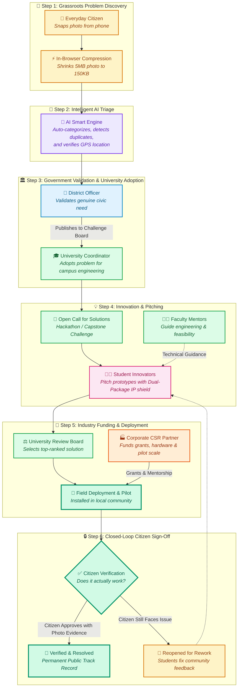
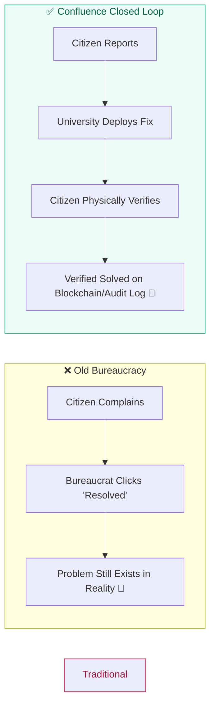
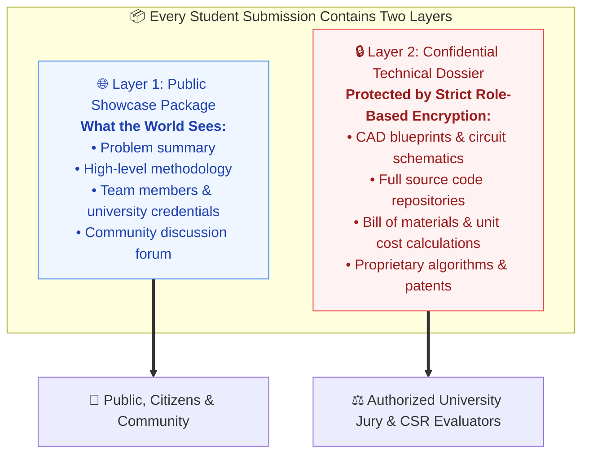

# 🌟 Confluence: How It Works
### *Turning Grassroots Civic Challenges into Student-Built, Industry-Funded Realities*

> **A Layman's Visual Guide for Judges, Citizens, Students, and Civic Leaders**
> 
> *Confluence replaces bureaucratic black holes with a transparent, closed-loop innovation pipeline where real community problems meet university engineering talent, corporate funding, and citizen-verified results.*

---

## 🧭 The Big Picture at a Glance

Imagine a world where reporting a broken water pipe in your village doesn't just disappear into a dusty municipal file, but instead becomes a **funded engineering capstone project** for bright local university students—and where **government officers cannot mark it "resolved" until YOU physically inspect it and give the green light.**



---

## 👥 The Five Key Actors: Who Does What?

| Actor | Real-Life Analogy | What They Do on Confluence | Why They Love It |
| :--- | :--- | :--- | :--- |
| **👤 Citizen** | *The Eyes on the Ground* | Snaps photos of local crises (water contamination, road craters, unlit roads). | Their voice isn't ignored; **they have final veto power** over whether a problem is truly fixed. |
| **🏢 Government Officer** | *The Quality Filter* | Checks reported issues to prevent spam and publishes legitimate challenges to universities. | Gets real-time map dashboards of civic distress without having to manually inspect every block. |
| **🎓 University Faculty** | *The Innovation Engine* | Adopts district problems into curriculum, hosts hackathons, and mentors student teams. | Replaces theoretical textbook assignments with high-impact research papers and student patents. |
| **👨‍🎓 Student Innovator** | *The Solution Architects* | Forms teams, builds prototypes, and pitches solutions to community challenges. | Gains practical startup experience, corporate sponsorships, official government awards, and career portfolios. |
| **🏭 Industry Partner** | *The Growth Catalyst* | Funds high-potential student prototypes through CSR grants and field sponsorships. | Directly meets Corporate Social Responsibility (CSR) and ESG quotas with measurable, transparent community impact. |

---

## 📖 A Story from Jharkhand: How a Problem Actually Gets Solved

To see how Confluence works in practice, follow the real-world journey of **Maya**, a mother living in Topchanchi village, Dhanbad.

```mermaid
sequenceDiagram
    autonumber
    actor Maya as 👤 Maya (Citizen)
    participant Phone as 📱 Confluence App
    participant AI as 🧠 AI Triage
    actor Officer as 🏢 Officer Verma (District Admin)
    actor Uni as 🎓 Prof. Sen (IIT ISM Dhanbad)
    actor Students as 👨‍🎓 Team JalShakti (Students)
    actor CSR as 🏭 Tata Steel CSR
    
    Maya->>Phone: Takes photo of rusted municipal handpump oozing turbid water
    Note over Phone: Browser compresses 6MB photo down to 180KB in 200ms
    Phone->>AI: Submits with GPS (23.90°N, 86.20°E)
    Note over AI: Categorizes: "Water & Sanitation"<br/>Duplicate Check: No duplicates in 2km radius<br/>Confidence: 94%
    AI->>Officer: High-priority civic challenge created
    Officer->>Uni: Validates problem & publishes to Jharkhand University Portal
    Uni->>Uni: Adopts problem #CH-042 for Campus Innovation Cell
    Uni->>Students: Issues 3-Week Open Call: "Low-Cost Arsenic/Turbidity Water Filter"
    Students->>Uni: Submits Pitch with Dual-Package Model
    Note over Students,Uni: Public Summary visible to public; Deep schematic encrypted for Review Board
    CSR->>Students: Reviews project and approves ₹75,000 pilot grant
    Students->>Maya: Installs ceramic multi-stage solar filtration unit in Topchanchi village
    Note over Students: Mark project "Field Deployed — Awaiting Verification"
    Maya->>Phone: Inspects clean drinking water flow & uploads confirmation photo
    Phone->>Officer: Community satisfaction score 5/5
    Note over Officer,Maya: Status changes to "RESOLVED & PERMANENT"
```

---

## 🚀 The 4 Unique Superpowers of Confluence
*(Why Judges and Policymakers Score This Platform #1)*

### 1. 🛡️ Closed-Loop Verification: "No Ghost Fixes"
In traditional government grievance portals, an official frequently clicks **"Closed / Fixed"** from their desk without ever visiting the site. 

On **Confluence, this is mathematically impossible**:
- When a university team deploys a solution, the challenge enters **"Awaiting Citizen Verification"**.
- The citizen who reported the problem receives a push prompt with camera verification.
- Only when the citizen inspects the physical fix and gives sign-off does the platform mark the issue **Resolved**.
- If the fix fails, the citizen clicks **"Still Broken"**—which automatically moves the issue back into the student engineering queue with actionable feedback!



---

### 2. ⚡ Bandwidth-Friendly Rural Edge (Client-Side Compression)
Citizens in rural, tribal, or low-connectivity zones often face unstable 2G/3G networks or strict mobile data limits.
- If an app forces them to upload raw 10MB camera photos, 70% of submissions time out or fail.
- **Confluence's Edge Engine** uses an in-browser HTML5 Canvas compressor before any byte travels across the network.
- High-resolution images are scaled and re-encoded locally in under **250 milliseconds**.
- **Results:**
  - **90% to 95% bandwidth saved** (e.g. **5.4 MB ➔ 180 KB**).
  - Instant uploads on patchy village towers.
  - Zero photo quality degradation for AI inspection.

---

### 3. 🔐 The Dual-Package IP Shield (Protecting Student Inventors)
Students often hesitate to submit innovative ideas to public competitions because they fear corporate sponsors or competitors might steal their designs.

Confluence solves this with a **Two-Compartment Pitch Model**:



---

### 4. 🧠 Instant AI Triage & Deduplication
Municipalities often drown in duplicate complaints when five neighbors report the same fallen tree or damaged transformer.
- When an issue is logged, Confluence's **AI Microservice** cross-references the title, description, and GPS coordinates against existing district issues.
- If it's a suspected duplicate, it automatically links it to the master issue rather than fragmenting municipal resources.
- If it's unique, it automatically tags the problem domain (e.g. *Water & Sanitation*, *Urban Infrastructure*, *Rural Energy*), calculates an urgency score, and directs it to the appropriate university department.

---

## 📊 Before Confluence vs. After Confluence

| Dimension | The Status Quo (Old Portals & Hackathons) | The Confluence Way |
| :--- | :--- | :--- |
| **Grievance Resolution** | Reports go into deep municipal backlogs with zero transparency. | Adopted within days as accredited university projects. |
| **Student Hackathons** | Students build toy apps that get deleted after the weekend. | Students build real prototypes that deploy in their own cities. |
| **Government Spending** | High consultancy fees for basic local surveys. | Mobilizes untapped campus engineering capital for public good. |
| **Accountability** | Closed by officers from remote offices without field proof. | **Citizen-verified physical sign-off** with timestamped evidence. |
| **Corporate CSR** | Blind check-writing with vague impact reports. | Transparent escrow funding with milestone-by-milestone student tracking. |

---

## 🏆 Summary for Evaluation Panels

> Confluence is **not just another grievance reporting portal**, and it is **not just another hackathon app**.
> 
> It is an **integrated civic operating system** that bridges three historically isolated silos:
> 1. **Citizens who have problems but no engineers.**
> 2. **Students who have engineering skills but lack real problems.**
> 3. **Government & Industry who have funds but lack ground-level execution.**
>
> By creating a verified, closed-loop pipeline from complaint to deployment, Confluence delivers real-world social impact that is transparent, tamper-proof, and measurable.

---

*Confluence Platform • Civic Tech Architecture • Document Version 2.4*
